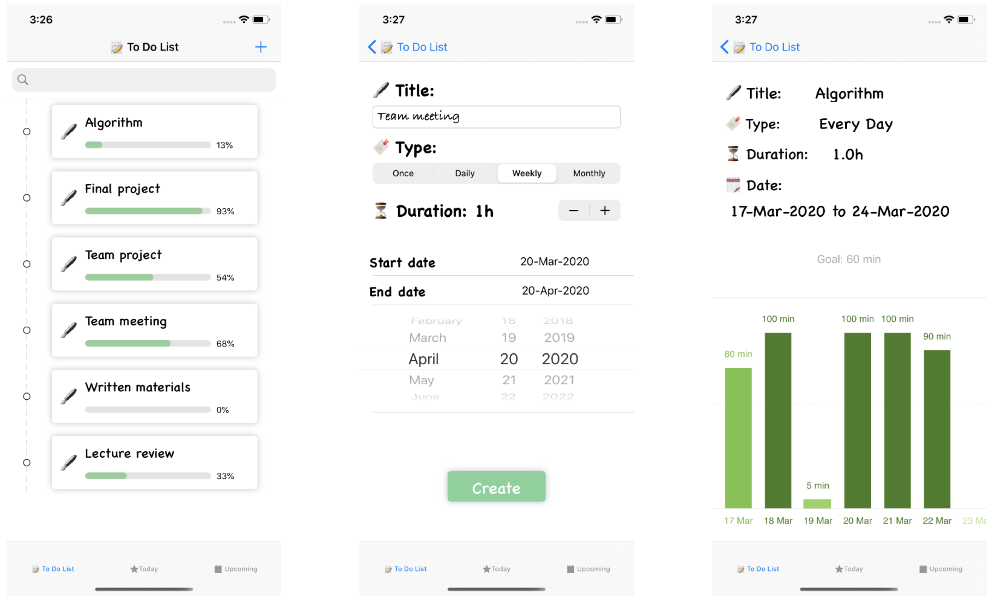
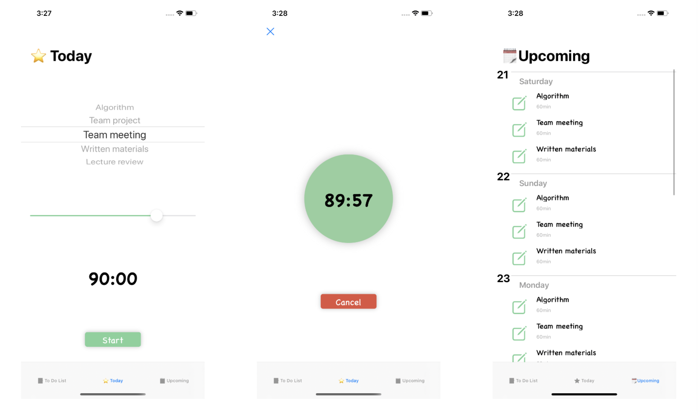

# Do it - Task Management Application

An application helping users manage long-term tasks, keep tracking and stay focused on them. Constructed of three parts:

- To Do List Tab View: manage tasks
  - Create Tasks by tapping "+" button, and type in title, choosing duration and start, end date
  - Edit Task by leading swipe the corresponding cell
  - Delete Task by tailing swipe the corresponding cell
  - Search Task in the search bar
  - Show histogram of time spending on the task each day by clicking the cell
- Today Tab View:
  - Check today's task
  - Chose task and a time length to start timing
- Upcoming Tab View:
  - Show upcoming tasks in a week

## Screenshots

## Marketing Description

Get things off your mind quickly with Tasks. The users can get a brief view of the statistics which shows how's the work going and where they are, the daily check-in feature allows users to stay focused on the tasks and get the things done quickly. Also, the Upcoming view will remind users what tasks they have in next few days.

Collect Your Thoughts
    Get things off your mind quickly with Tasks, click the "+" button, fill in the information of the task (title, type, duration per day, start date and end date), then you will have a clear view of the tasks with progress bars to remind you how much have been done. Also, there is a search bar to help you locate the task with key word. 

Check In Everyday
    "Today" section will show you the things need to do today. Select a task, set a time duration, click "Start" button, then just stay focused.

Upcoming Tasks
    Check what's next. The "Upcoming" section will give you a quick view of the tasks in next 7 days.

References:

collapsible table in SetScheduleViewController: https://github.com/jeantimex/ios-swift-collapsible-table-section
